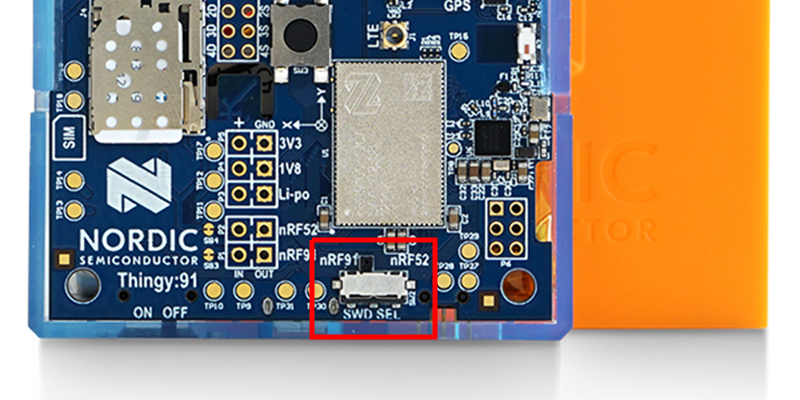
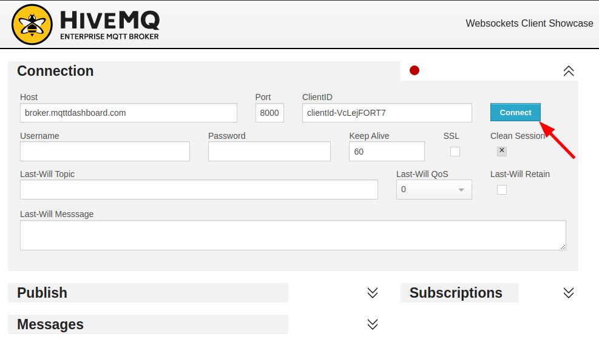
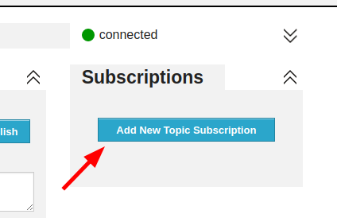
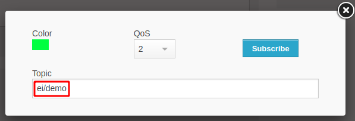
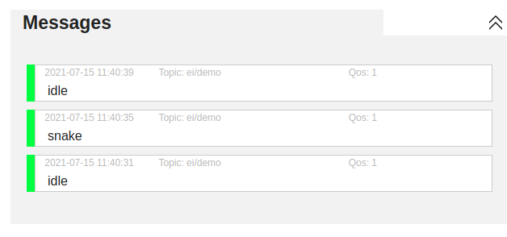

# Edge Impulse firmware for Nordic Semi Thingy:91

[Edge Impulse](https://www.edgeimpulse.com) enables developers to create the next generation of intelligent device solutions with embedded Machine Learning. This repository contains the Edge Impulse firmware for the Nordic Semiconductor Thingy91 development board. This combination supports all Edge Impulse device features, including ingestion, remote management and inferencing.

> **Note:** Do you just want to use this development board with Edge Impulse? No need to build this firmware. See the instructions for the [Thingy91](https://docs.edgeimpulse.com/docs/nordic-semi-thingy91) for a prebuilt image and instructions, or use the [data forwarder](https://docs.edgeimpulse.com/docs/cli-data-forwarder) to capture data from any sensor.

## How to build

**1. Setting up NCS**

1. Install the [nRF Connect SDK](https://developer.nordicsemi.com/nRF_Connect_SDK/doc/latest/nrf/gs_installing.html) in a *separate* folder from this repository (e.g. `~/repos/ncs`).
1. Check out NCS version 1.7.0:

    ```
    $ cd ~/repos/ncs/nrf
    $ git checkout v1.7.0
    $ cd ..
    $ west update
    ```

1. Set your `ZEPHYR_BASE` environment variable to `~/repos/ncs/zephyr`.

**2. Building and flashing the `connectivity bridge`**

If you Thingy91 is not registering two serial ports after connecting to PC through Micro USB cable, then you have to flash the `connectivty bridge` firmware. Otherwise, go to the next step.

1. Building the `connectivity bridge`:

    ```
    $ cd connectivity_bridge/
    $ west build -b thingy91_nrf52840
    ```

1. To flash the `connectivity bridge` using JLink, do as follows:
    1. Ensure that the `SWD SELECT` switch is in `nRF52` postion.

        

    1. Connect you Thingy91 to JLink (eg. another Nordic's DK) as show [here](https://infocenter.nordicsemi.com/topic/ug_thingy91_gsg/UG/thingy91_gsg/updating_fw_ext_probe.html?cp=14_0_3_1)
    1. Flash:

        ```
        $ west flash
        ```

1. To flash the firmware using USB cable and serial bootloader

    > **Note:** Make sure your `Thingy91` has original firmware and wasn't manualy flashed with any other firmware

    Follow [this instruction](https://infocenter.nordicsemi.com/topic/ug_thingy91_gsg/UG/thingy91_gsg/updating_fw_usb.html?cp=14_0_3_0) (steps 1 to 3). In the step 3f-3g use the following file: `connectivity_bridge/build/zephyr/app_signed.hex`

**3. Building and flashing the application**

1. Go back to the `firmware-nordic-thingy91` directory (don't run this command from the `connectivity_bridge` folder).
1. Build the application:

    ```
    $ west build -b thingy91_nrf9160_ns
    ```

1. To flash the application using JLink, do as follows:
    1. Switch the `SWD SELECT` switch back to the `nRF91` position.
    1. Connect you Thingy91 to JLink (eg. another Nordic's DK) as show [here](https://infocenter.nordicsemi.com/topic/ug_thingy91_gsg/UG/thingy91_gsg/updating_fw_ext_probe.html?cp=14_0_3_1)
    1. Flash:

        ```
        $ west flash
        ```

1. To flash the firmware using USB cable and serial bootloader

    > **Note:** Make sure your `Thingy91` has original firmware and wasn't manualy flashed with any other firmware

    Follow [this instruction](https://infocenter.nordicsemi.com/topic/ug_thingy91_gsg/UG/thingy91_gsg/updating_fw_usb.html?cp=14_0_3_0) (steps 1, 2 and 5 only). In the step 5f-h use the following file: `build/zephyr/app_signed.hex`

That's it. You can now connect to the device through the Edge Impulse CLI or through WebUSB, as described [here](https://docs.edgeimpulse.com/docs/nordic-semi-nrf5340-dk#4-setting-keys).

## Running your ML model

To update your ML model:

1. [Train a model in Edge Impulse](https://docs.edgeimpulse.com).
1. On the **Deployment** page in the Studio, export as a C++ library.
1. Remove the `edge-impulse-sdk`, `model-parameters` and `tflite-model` directories in this repository.
1. Add the folders from the C++ library (but **not** the CMakeLists.txt file) to this repository.
1. Rebuild the application.
1. Run your model via:

    ```
    $ edge-impulse-run-impulse
    ```

    (Add `--continuous` to run continuous audio classification)

### MQTT demo

To see the output of inference process, make to following steps after deploying ML model:
1. If you use the iBasis SIM card provided in the Thingy91 kit, create an account on [nRF Cloud](https://www.nrfcloud.com) and add a new SIM card.
1. Insert SIM Card to Thingy91 and power cycle the board.
1. Open Serial Port Terminal of the Thingy91 (use first port eg. `ttyACM0` on Linux)
1. Connect the board to MQTT server issuing the follwoing command:

    ```
    AT+CONNECT
    ```

    The connection can take while and as a result you should get the `OK` response or `ERROR` if something went wrong.

1. After successfull connection run the model:

    ```
    AT+RUNIMPULSE
    ```

1. Open [HiveMQ Online MQTT Client](http://www.hivemq.com/demos/websocket-client/) and click `Connect`

    

1. After connection, click `Add New Topic Subscription`, in the dialog enter topic `ei/demo` and click `Subscribe`

    

    

1. After that you should start seeing messages incoming from `Thingy91`

    


## Dependencies
* NCS version: **1.7.0**
* default **Thingy91** (any revision)
